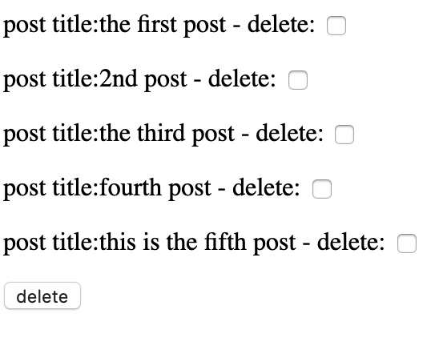

# Django_Delete_Files_At_Once

[referred blog](https://narito.ninja/blog/detail/90/)



> ## models.py
``` python
from django.db import models


class Post(models.Model):
	title = models.CharField(max_length=200, unique=True)

	# def __str__(self):
	#     return self.file.url

	def __str__(self):
		return self.title
```

> ## admin.py
``` python
from django.contrib import admin
from .models import Post

admin.site.register(Post)
```

> ## views.py
``` python
from django.shortcuts import redirect
from django.views import generic
from .models import Post


""" In case that delete() by using filter() """

# class PostIndex(generic.ListView):
# 	model = Post

# 	def post(self, request):
# 		post_pks = request.POST.getlist('delete')  # the name 'delete' was set in <input type="checkbox" name="delete" in template
# 		Post.objects.filter(pk__in=post_pks).delete()
# 		return redirect('app:post_list')  # redirecting the template, post_list.html

# request.POST.getlist('delete') gives a list such as ['1','2','3']
# on the other hand, request.POST['name'] gives one value, for example


""" In case that delete() with ModelFormSet """

from django import forms
from django.shortcuts import redirect, render
from .models import Post

PostFormSet = forms.modelformset_factory(Post, fields='__all__', can_delete=True, extra=0)

# modelformset_factory関数の引数、can_delete=Trueで削除チェックボックスが作れるようになり
# extra=0は新規の作成フォームを作りません。あくまで今回は、モデルフォームセットを一覧表示+削除チェックボックスのために使うので
# データの新規作成フォームは要らないですね。

def postindex(request):
    formset = PostFormSet(request.POST or None)
    if request.method == 'POST' and formset.is_valid():
        formset.save()
        return redirect('app:post_list')

    context = {
        'formset': formset,
    }

    return render(request, 'app/post_list.html', context)

```

> ## urls.py
``` python

```

> ## uploadfile_list.html
``` python

```
